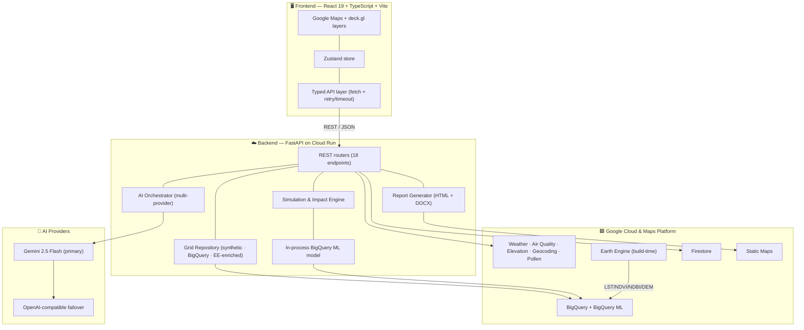

<div align="center">

# 🌆 ClimaTwin

### An AI-Powered Urban Climate Decision-Intelligence Platform

*Don't just see the heat — stand in the street, try a fix, and watch the city cool.*

[](https://climatwin-980129431310.asia-south1.run.app)
[](#testing)
[](#testing)
[](LICENSE)
[](#performance)

**React 19** · **TypeScript** · **FastAPI** · **Google Cloud Run** · **Gemini 2.5 Flash** · **BigQuery ML** · **Earth Engine** · **deck.gl**

[Live Demo](https://climatwin-980129431310.asia-south1.run.app) · [Features](#-features) · [Architecture](#-architecture) · [Installation](#-installation) · [Roadmap](#-roadmap)

</div>

---

## 📖 Project Overview

**ClimaTwin** is a decision-intelligence platform for **urban climate resilience**. It turns fragmented environmental data into decisions a city planner can act on: pick any point in a city, read its live microclimate, design an intervention within a budget, simulate the measurable impact, and export a board-ready planning report — across **heat, flood, air quality, and green-infrastructure** hazards.

### The problem it solves

Cities generate enormous volumes of environmental data, but planners still act **blind and one project at a time**. Existing tools are *descriptive* — they show *where* it is hot or flood-prone — but none prove the **consequence of a fix** before money is spent. Chennai, ClimaTwin's demo city, faces climate whiplash: 40–45 °C feels-like heat, monsoon flooding, and chronic poor air, with siloed responses.

### Why ClimaTwin is different

| Most tools | ClimaTwin |
|---|---|
| Descriptive — show the problem | **Prescriptive** — model the solution |
| Single hazard | **Multi-hazard** on one engine (heat · flood · air · green) |
| Static dashboards | **Simulation-first** — act on the map, see the consequence in seconds |
| Opaque scores | **Explainable** — uncertainty bands + cited coefficients on every number |
| Rich-and-hot bias | **People-centered** — equity-weighted toward vulnerable, data-poor areas |

### Key capabilities

- 🗺️ **Interactive digital twin** of the city with four live hazard layers
- 🧠 **AI recommendations** and a **fixed-budget optimizer** that designs the best intervention mix per rupee
- 📊 A **multi-metric simulation engine** (temperature, air, flood volume, canopy, carbon, water, cost)
- 📄 **Professional planning-report generation** (HTML + Word) with an AI narrative and embedded maps
- 🛰️ Real **satellite** and **live sensor** data, a **BigQuery ML** cooling model, and **multi-provider AI resilience**

### Vision

Start in **Chennai**, then scale the same engine to **Tamil Nadu → India → global cities** — a governed, free-to-run decision layer that helps any municipality turn climate data into proven, fundable action.

> **Note on scope.** ClimaTwin was built for the Google Gen AI Academy (APAC) hackathon and is an actively evolving prototype. Every figure it produces is **model-derived and clearly labelled illustrative**; it is designed to support planning discussion, not to replace site survey and detailed engineering. Features are marked **Implemented / In Progress / Planned** throughout this document.

---

## ✨ Features

### ✅ Implemented

| Feature | Description |
|---|---|
| **Interactive Digital Twin** | Tilted, dark-vector Google Map with four hazard layers rendered as `deck.gl` overlays; click any coordinate to inspect it. |
| **Heat Analysis** | Live feels-like temperature (Google Weather API), urban-heat-island field, canopy deficit, and a trained land-surface-temperature model. |
| **Flood Analysis** | Elevation-driven (Google Elevation / SRTM) + rainfall-probability flood risk, drainage proximity, and detention infrastructure context. |
| **Air Quality Analysis** | Live AQI, dominant pollutant, and health guidance (Google Air Quality API); pollution-exposure gradients. |
| **Green Infrastructure Analysis** | Canopy / NDVI density, biodiversity-corridor connectivity, and fragmentation gaps. |
| **Context-Aware Interventions** | **46 interventions across four per-hazard libraries** — the panel adapts to the selected hazard (native trees & cool roofs for heat; rain gardens & detention basins for flood; low-emission zones & green buffers for air; urban forests & corridors for green). |
| **Simulation Engine** | Multi-metric impact: temperature drop, AQI improvement, flood volume managed, canopy added, carbon sequestered, water retained, people benefited, and capital + maintenance + 5/10-year cost. |
| **Budget Optimization** | Two workflows — *Manual mix* (select → cost) and *AI budget plan* (fixed budget → optimal diversified plan by benefit-per-rupee), with presets ₹50 L / ₹2 Cr / ₹10 Cr. |
| **AI Recommendations** | Ranked intervention mix with per-item rationale, assumptions, confidence, and expected impact. |
| **Scenario Comparison** | Save and compare **Scenario A / B / C** across all metrics with a best-value verdict. |
| **AI Report Generation** | One-click **professional planning report** — HTML (print-to-PDF) and **Word (.docx)** — with AI executive summary, study area, current assessment, why-selected / why-rejected, impact, budget, timeline, risk, methodology, and appendices; **embedded Google Static Maps**. |
| **Anomaly Detection** | Local spatial outliers ("a street much hotter than its neighbourhood", "a canopy gap") ranked with plain-language explanations. |
| **Explainable AI** | Uncertainty bands + literature-cited coefficients on every number; per-metric data provenance; cross-check against the BigQuery ML model. |
| **Natural-Language Q&A (RAG)** | Ask ClimaTwin a plain-English question — answered from a curated knowledge corpus + a live city-data digest. |
| **Google Maps Integration** | `@vis.gl/react-google-maps` base map, forward/reverse geocoding, satellite basemap, and server-side Static Maps for reports. |
| **Environmental Data Layers** | Live per-point Weather, Air Quality, Elevation, Geocoding, and Pollen (see [Data Sources](#-data-sources)). |
| **Scenario Persistence** | Save/retrieve scenarios by shareable id, backed by **Firestore** with an in-memory fallback. |
| **Multi-Provider AI Resilience** | Gemini 2.5 Flash primary with **automatic failover** so the assistant never goes dark (see [AI Components](#-ai-components)). |
| **Production Hardening** | Per-IP rate limiting, security headers, request-id correlation, structured logging, and graceful degradation everywhere. |

### 🚧 In Progress / Partial

| Feature | Status |
|---|---|
| **Earth-Engine-enriched grid** | Real MODIS LST / NDVI / SRTM DEM are exported to BigQuery and joinable to the analysis grid; served **on demand** via a `grid_source=ee_enriched` toggle (off by default to keep demo numbers stable). |
| **Live Pollen** | Wired and working where Google provides coverage; **India has no Pollen coverage**, so pollen is **modeled** from local vegetation and clearly labelled as modeled. |
| **Flood model** | Elevation + rainfall **heuristic**, not yet a calibrated hydrological model. |
| **Vulnerability data** | Census-informed **model estimate** (population, elderly share, footfall), not live census/WorldPop. |

### 🔭 Planned (Future Prototype Build / Future Upgrades)

- **Authentication & shareable links** — the API layer is auth-ready (Bearer-token plumbing); an identity provider and UI sign-in are planned.
- **Calibrated hydrological flood model** and **live census / WorldPop** population layers.
- **Photorealistic 3-D tab** (CesiumJS / Google 3-D Tiles) — a gated "wow" view.
- **Generative before/after imagery** (Imagen) alongside the numeric before/after.
- **PWA / offline install** and deeper mobile-native experience.
- **Multi-city expansion** — Chennai → Tamil Nadu → India (the region registry already abstracts this).

---

## 🖼️ Screenshots

> High-resolution screenshots live in [`docs/screenshots/`](docs/screenshots). Drop the PNGs listed below into that folder to render them inline. Captions describe each screen.

| Screen | File | What it shows |
|---|---|---|
| **Dashboard** | `docs/screenshots/dashboard.png` | The full digital twin — top bar (hazard toggle, search, Planner/Citizen), map, and decision sidebar. |
| **Heat Layer** | `docs/screenshots/heat.png` | Urban-heat-island field with flagged bus-corridor hotspots. |
| **Flood Layer** | `docs/screenshots/flood.png` | Elevation-driven flood exposure along low-lying drainage. |
| **Air Quality Layer** | `docs/screenshots/air.png` | AQI exposure gradient along traffic corridors. |
| **Green Infrastructure** | `docs/screenshots/green.png` | Canopy connectivity and fragmentation gaps. |
| **Simulation** | `docs/screenshots/simulation.png` | Context-aware intervention panel, budget workflow, and multi-metric result. |
| **Report Generation** | `docs/screenshots/report.png` | The 7-step report workflow and the exported planning document. |
| **Scenario Compare** | `docs/screenshots/scenarios.png` | A/B/C multi-metric comparison with the best-value verdict. |

---

## 🏗️ Architecture

ClimaTwin is a single Cloud Run service: **FastAPI serves the compiled React SPA** and the JSON API from one container. Heavy data pipelines (Earth Engine export, BigQuery ML training) run **build-time**, so the runtime stays fast and free.



| Layer | Responsibility |
|---|---|
| **Frontend** | React 19 + TypeScript + Vite SPA. Renders the map, hazard layers, decision HUD, and report workflow. Code-split so the heavy `deck.gl` map bundle loads lazily. |
| **Backend** | FastAPI (async) on Cloud Run — stateless, scales to zero. Owns routing, validation, AI orchestration, simulation, and report rendering. |
| **AI Layer** | A provider-agnostic orchestrator (`app/llm/`) with an LRU cache, safety settings, and schema-constrained JSON output. Falls through providers on any failure, then to deterministic rule-based output. |
| **Data Layer** | A **Grid Repository** abstraction selects the analysis grid at startup: in-code synthetic urban-form grid, a **BigQuery** table, or an **Earth-Engine-enriched** hybrid — swappable without touching routers. |
| **Simulation Engine** | Literature-informed, multi-metric coefficient model, cross-checked against the trained BigQuery ML land-surface-temperature model; every number carries an uncertainty band and citations. |
| **Map Engine** | Google Maps base + `deck.gl` overlays, with a multi-resolution tile API (`/tiles/{hazard}/{z}/{x}/{y}`) serving LOD bands from country down to street. |
| **Report Generator** | Assembles a structured report + AI narrative, renders self-contained **HTML** and **DOCX**, and embeds server-downloaded **Static Maps**. The client prints the HTML to **PDF**. |
| **State Management** | A single **Zustand** store holds hazard, selection, live point, mix, budget, simulation, scenarios, and report state. |
| **API Layer** | A typed `services/api.ts` with timeouts, retries, and an auth-ready Bearer-token hook. |
| **Authentication** | *Planned.* The API layer is structured for a Bearer token; no identity provider is wired yet. |
| **Future Scalability** | Stateless Cloud Run + a **region registry** (`app/regions.py`) that lets new cities be added as data, not code — the path from Chennai to all of India. |

---

## 🧰 Technology Stack

Every choice is deliberately **free-tier-first** and **horizontally scalable**.

| Technology | Why it was chosen |
|---|---|
| **React 19 + TypeScript** | Type-safe, component-driven UI; concurrent rendering keeps the map responsive while data streams in. |
| **Vite** | Near-instant HMR in dev and an optimised, code-split production bundle (the heavy map chunk is lazy-loaded). |
| **Zustand** | Minimal, boilerplate-free global state that fits a single-screen decision tool far better than Redux. |
| **Google Maps (`@vis.gl/react-google-maps`)** | A real, accurate base map (a requirement, not artwork) with first-class React bindings. |
| **deck.gl** | GPU-accelerated overlays for large point/field/path layers, with a native Google Maps integration — the "digital-twin" visual identity. |
| **FastAPI** | Async Python, automatic validation via Pydantic, and OpenAPI docs — fast to build, fast to run, scales to zero on Cloud Run. |
| **Pydantic v2** | Strict request/response validation and settings management, keeping the API contract honest. |
| **Google Cloud Run** | Serverless containers that scale to zero — ideal for a ≈$0 runtime with no idle cost. |
| **Gemini 2.5 Flash (AI Studio)** | A fast, capable, **free-tier** model — no Vertex AI, no paid endpoint — for recommendations, Q&A, and report narratives. |
| **BigQuery + BigQuery ML** | Serverless analytics warehouse; **BQML** trains an explainable linear cooling model in SQL with no ML infrastructure. |
| **Google Earth Engine** | Planet-scale satellite catalog (MODIS, Landsat, SRTM) sampled **build-time** into BigQuery — real LST/NDVI/NDBI/DEM at zero runtime cost. |
| **Firestore** | Serverless document store for scenario persistence with a shareable id. |
| **python-docx** | Generates the Word (.docx) planning report server-side. |
| **httpx** | Async-friendly HTTP client for live Google APIs and the OpenAI-compatible AI fallbacks. |

---

## 🌐 Data Sources

ClimaTwin never implies data is real when it is modeled. Provenance is attached per metric in the `/point` response and surfaced in the UI.

| Source | Type | Status |
|---|---|---|
| **Google Weather API** — feels-like, temp, humidity, condition, rain probability | Live API | ✅ Live, per point |
| **Google Air Quality API** — AQI, dominant pollutant, health guidance | Live API | ✅ Live, per point |
| **Google Elevation API** — ground elevation (flood model) | Live API | ✅ Live, per point |
| **Google Geocoding API** — place names + forward search | Live API | ✅ Live |
| **Google Pollen API** — tree/grass/weed pollen | Live API | ✅ Live where covered; **modeled for India** (no coverage) |
| **Google Earth Engine** — MODIS LST, MODIS NDVI, Landsat NDBI, SRTM DEM | Satellite (build-time → BigQuery) | ✅ Exported to `grid_ee`; opt-in on the map |
| **BigQuery ML** — linear land-surface-temperature model (R² ≈ 0.70) | Derived (trained) | ✅ Trained; served in-process |
| **Analysis grid** (`grid_cells`) | Derived / synthetic urban-form | ✅ Served from BigQuery, synthetic fallback |
| **Intervention coefficients** — cooling/cost per unit | Derived (literature: US EPA, FAO, i-Tree, ASU) | ✅ Cited; illustrative |
| **Vulnerability** — population, elderly %, footfall | Synthetic placeholder (census-informed) | ⚠️ Modeled, not live census |
| **Green corridors / fragmentation** | Synthetic placeholder | ⚠️ Modeled |
| **WorldPop / live census** | — | 🔭 Future integration |

---

## ⚙️ Installation

### Prerequisites

- **Node.js 20+** and **Python 3.12+**
- A **Google Cloud project** with billing enabled
- Google API keys: a **Gemini** (AI Studio) key and a **Google Maps Platform** key (Maps JS, Weather, Air Quality, Elevation, Geocoding, Pollen, Static Maps)
- *(Optional, for cloud data)* `gcloud` CLI authenticated with Application Default Credentials; BigQuery, Firestore, and Earth Engine enabled

### Environment variables

Copy the templates and fill in your keys:

```bash
cp backend/.env.example backend/.env
cp frontend/.env.example frontend/.env
```

| Variable | Purpose |
|---|---|
| `GEMINI_API_KEY` | Gemini 2.5 Flash (AI Studio free tier) |
| `GOOGLE_MAPS_API_KEY` | Browser Maps key (referrer-restricted) |
| `SERVER_API_KEY` | Server-side key (Weather / Air Quality / Elevation / Geocoding / Pollen / Static Maps) |
| `GRID_SOURCE` | `auto` (BigQuery→synthetic) · `bigquery` · `ee_enriched` · `synthetic` |
| `GCP_PROJECT`, `BQ_DATASET`, `BQ_LOCATION` | Cloud project + BigQuery dataset/region |
| `GROQ_API_KEY`, `CEREBRAS_API_KEY` | *(optional)* redundant AI failover providers |

### Local development

```bash
# Backend
python -m venv backend/.venv
backend/.venv/Scripts/pip install -r backend/requirements.txt      # Windows
# source backend/.venv/bin/activate && pip install -r backend/requirements.txt   # macOS/Linux
backend/.venv/Scripts/python -m uvicorn app.main:app --reload --app-dir backend --port 8000

# Frontend (new terminal)
cd frontend && npm install && npm run dev    # http://localhost:5173
```

### Build

```bash
cd frontend && npm run build      # type-checks (tsc -b) and bundles to frontend/dist
```

### Production deployment (Cloud Run)

A single command builds the two-stage Docker image (Vite → static, FastAPI serves it) and deploys:

```bash
gcloud run deploy climatwin --source . --region asia-south1 \
  --allow-unauthenticated --memory 1Gi \
  --set-env-vars "GEMINI_API_KEY=...,GOOGLE_MAPS_API_KEY=...,SERVER_API_KEY=...,GRID_SOURCE=auto"
```

To use the BigQuery grid + Firestore in production, grant the Cloud Run runtime service account `roles/bigquery.dataViewer`, `roles/bigquery.jobUser`, and `roles/datastore.user`. Build-time data pipelines:

```bash
pip install -r backend/requirements-buildtime.txt
python backend/scripts/load_grid_to_bigquery.py       # seed the grid
python backend/scripts/train_lst_model_bqml.py        # train the BQML model + export weights
python backend/scripts/export_earth_engine.py         # export satellite layers → BigQuery
```

---

## 🧭 Usage Guide

1. **Launch the application** — open the [live demo](https://climatwin-980129431310.asia-south1.run.app) or `http://localhost:5173`.
2. **Select a location** — click anywhere on the map (or search a place). The sidebar fills with the live microclimate readout and a short forecast.
3. **Choose a hazard** — toggle **Heat / Flood / Air / Green** in the top bar; the map layer and the intervention library both adapt.
4. **View environmental indicators** — feels-like temperature, AQI, flood risk, canopy/NDVI, elevation, vulnerability, and the model's predicted baseline.
5. **Configure interventions** — in *Manual mix*, add measures from the hazard-specific palette with the ± steppers.
6. **Set a budget** — or switch to **AI budget plan**, pick a preset (₹50 L / ₹2 Cr / ₹10 Cr), and let the optimizer design the best plan within it.
7. **Run the simulation** — see temperature drop, AQI/flood/canopy/carbon impact, people benefited, capital + maintenance + 5/10-year cost, ROI, confidence, and risks.
8. **Compare scenarios** — save as **A / B / C** and read the multi-metric comparison with a best-value verdict.
9. **Generate the report** — click **Generate planning report**, watch the 7-step workflow, then **Open · Print PDF** or **Download Word** — a decision-ready document with an AI narrative and embedded maps.

---

## 🧠 AI Components

### Multi-provider orchestration (`app/llm/`)

ClimaTwin's AI is a **resilient provider chain**, not a single call:

```
Gemini 2.5 Flash  →  redundant OpenAI-compatible failover  →  deterministic rule-based/template output
```

- **Gemini 2.5 Flash** is the primary reasoning engine (recommendations, Q&A, report narratives).
- If a call fails or is rate-limited, the orchestrator **automatically fails over** to redundant OpenAI-compatible inference providers (Groq Llama 3.3 70B, Cerebras) — so the app never goes dark. This resilience is internal and transparent to the user.
- If **every** provider is unavailable, endpoints return a **deterministic rule-based / templated** result, so the product still works at zero AI cost.
- An **in-process LRU cache** keys on the prompt, so repeated prompts are answered once regardless of which provider served them.

| Concern | Implementation |
|---|---|
| **Recommendation engine** | Builds a benefit-per-rupee intervention mix, then asks the model for a plain-language rationale, trade-offs, and assumptions (structured JSON). |
| **Budget optimizer** | Diversified greedy allocation across the hazard's library within a fixed budget; the model explains *why* the plan fits the location. |
| **Simulation engine** | Deterministic coefficient model with multi-metric outputs; the model narrates, it does not fabricate the numbers. |
| **Prompt engineering** | Role/policy live in a **system instruction**; untrusted user questions are delimited and sanitized (prompt-injection guard); JSON responses are schema-constrained. |
| **Report generation** | A single structured-JSON call produces the executive summary, why-selected/rejected, benefits, timeline, and risks; the server renders the document. |
| **Confidence** | Every headline number carries an uncertainty band, cross-checked against the BigQuery ML model. |
| **Explainability** | Interventions cite their coefficient sources; data carries per-metric provenance; the trained model's weights are the explanation. |
| **Responsible AI** | Safety thresholds on every Gemini call; only aggregate data (no personal information); model figures are labelled illustrative. |

### Current limitations

- Gemini's **free tier has a daily quota**; under heavy use it rate-limits, at which point the failover chain (and finally the rule-based path) keeps the app responsive.
- The simulation model is **literature-informed and illustrative**, not site-calibrated.
- The BigQuery ML model predicts land-surface temperature from urban-form features; it is a linear, explainable baseline, not a full physical model.

---

## 🗺️ Roadmap

### ✅ Completed
- Interactive four-hazard digital twin with live Google environmental data
- BigQuery-backed analysis grid + **BigQuery ML** cooling model (R² ≈ 0.70)
- Earth Engine → BigQuery satellite export (LST / NDVI / NDBI / DEM)
- Context-aware intervention libraries, multi-metric simulation, and the fixed-budget optimizer
- Anomaly detection, RAG-grounded Q&A, A/B/C scenario comparison
- Professional HTML/DOCX report generation with embedded maps
- Firestore scenario persistence, multi-provider AI resilience, and production hardening
- Deployed on Cloud Run at ≈ $0 runtime

### 🚧 Currently Developing
- Earth-Engine-enriched grid as a first-class map mode (currently an opt-in toggle)
- Calibrated hydrological flood model; live census / WorldPop vulnerability
- Authentication + shareable scenario links (API is auth-ready)

### 🔭 Future Roadmap
- Photorealistic 3-D tab (CesiumJS / 3-D Tiles) · Imagen before/after imagery · PWA / offline
- **Geographic expansion:**

```
Chennai  →  Tamil Nadu  →  India
```

The region registry (`app/regions.py`) is designed so each new city is **added as data, not code**.

---

## ⚡ Performance

| Area | Approach |
|---|---|
| **Caching** | In-process LRU caches for AI completions (keyed by prompt) and per-coordinate live readouts (TTL + bounded LRU, memory-safe under load); a 30-minute cache for live hazard-grid anchors. |
| **Map rendering** | GPU-accelerated `deck.gl` layers; a multi-resolution **tile API** serves only the visible LOD band (country → street) with a one-cell margin for seamless interpolation. |
| **Loading** | Code-splitting lazy-loads the heavy map bundle; the SPA shell paints first. |
| **Spatial indexing** | The city lattice is a regular grid, so a tile maps to an index range in O(1); anomaly detection bins cells for O(n) neighbourhood comparison. |
| **Non-blocking reads** | `/grid` returns instantly and refreshes live anchors in the background, matching the "instant reads; live calls only for the selected point" design. |
| **Startup** | The analysis grid loads once into memory at startup (from BigQuery, with synthetic fallback), so per-request latency stays ~0. |
| **Future optimization** | Response caching for tile/report payloads, CDN for static assets, and sharded BigQuery for multi-city scale. |

---

## 📁 Repository Structure

```
ProjectTobeNamed/
├── backend/
│   ├── app/
│   │   ├── main.py              # FastAPI app, lifespan (grid load), router registration
│   │   ├── config.py            # Pydantic settings (env-driven)
│   │   ├── hardening.py         # rate limiting, security headers, request-id observability
│   │   ├── data.py              # deterministic synthetic urban-form grid + intervention catalogue
│   │   ├── realtime.py          # live Google APIs (Weather/Air/Elevation/Geocoding/Pollen), cached
│   │   ├── model.py             # multi-metric impact/simulation engine
│   │   ├── report.py            # HTML + DOCX report rendering, Static Maps, SVG charts
│   │   ├── knowledge.py         # RAG corpus + retriever
│   │   ├── pollen_model.py      # modeled pollen where no live coverage
│   │   ├── regions.py           # region registry (Chennai → … scalability seam)
│   │   ├── datasets.py          # multi-resolution reference data (country/state)
│   │   ├── llm/                 # multi-provider AI orchestrator (Gemini + failover)
│   │   ├── ml/                  # in-process BigQuery ML model (weights card + serving)
│   │   ├── data_access/         # grid repositories: synthetic · BigQuery · EE-enriched · scenarios
│   │   ├── routers/             # 18 REST endpoints (point, grid, simulate, optimize, report, …)
│   │   └── sample_data/         # grid + intervention catalogue (JSON)
│   ├── scripts/                 # build-time: load grid, train BQML, export Earth Engine
│   ├── tests/                   # 115 pytest tests (offline, deterministic)
│   └── requirements*.txt        # runtime + build-time dependencies
├── frontend/
│   └── src/
│       ├── App.tsx / App.css    # shell + design-system stylesheet
│       ├── store/               # Zustand store (single source of truth)
│       ├── services/api.ts      # typed API layer (timeouts, retries, auth hook)
│       └── features/
│           ├── layout/          # header (search, hazard + view toggles)
│           ├── map/             # Google Map + deck.gl layers, overlays, geo helpers
│           ├── hazards/         # per-hazard colour/legend/copy
│           ├── sidebar/         # microclimate, vulnerability, simulate, report cards
│           └── simulation/      # intervention palette
├── docs/                        # design system, architecture, budget, implementation tracker
├── Dockerfile                   # two-stage build (Vite → static, FastAPI serves it)
└── LICENSE
```

---

## 🤝 Contributing

Contributions are welcome. To propose a change:

1. **Fork** the repository and create a feature branch (`git checkout -b feature/your-feature`).
2. **Develop** with tests. Keep the backend deterministic and offline-safe; keep the UI's visual language consistent.
3. **Run the suites** before opening a PR:
   ```bash
   backend/.venv/Scripts/python -m pytest backend        # 115 tests
   cd frontend && npm run test                           # 30 tests
   npm run build                                          # type-check + bundle
   ```
4. **Open a pull request** with a clear description, screenshots for UI changes, and a note on any new environment variables or data sources.

Please keep every user-facing number **honest** — label modeled/illustrative values as such, and cite coefficient sources.

<a id="testing"></a>
**Testing:** 115 backend tests (pytest, fully mocked — no network or API quota) and 30 frontend tests (Vitest).

---

## 📜 License

Released under the **MIT License** — see [LICENSE](LICENSE). © 2026 Ashfaque Rifaye.

---

## 🙏 Acknowledgements

- **Google Cloud** — Cloud Run, BigQuery & BigQuery ML, Firestore
- **Google Maps Platform** — Maps JavaScript, Weather, Air Quality, Elevation, Geocoding, Pollen, and Static Maps APIs
- **Google Earth Engine** — MODIS, Landsat, and SRTM datasets
- **Google Gemini** (AI Studio) — the primary reasoning engine
- **deck.gl** & **vis.gl** — GPU-accelerated geospatial visualization
- **FastAPI**, **Pydantic**, **React**, **Vite**, **Zustand**, and the open-source community
- Intervention coefficients informed by **US EPA**, **FAO**, **US Forest Service (i-Tree)**, and **Arizona State University** urban-heat research
- Built for the **Google Gen AI Academy — APAC Edition** hackathon

<div align="center">

**ClimaTwin** — *turning climate data into decisions cities can act on.*

</div>
